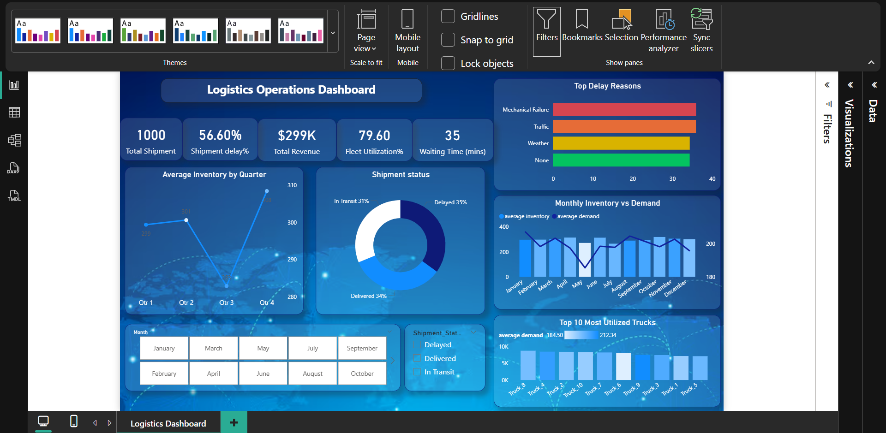

# 🚚 Logistics Operations Dashboard (Power BI)

## 📌 Project Overview

This project is an interactive Logistics Operations Dashboard built using Microsoft Power BI. It provides insights into logistics performance by analyzing shipments, revenue, fleet utilization, inventory, and delivery delays.

---

## 📊 Key KPIs

- Total Shipments
- Total Revenue
- Fleet Utilization
- Average Waiting Time
- Delayed Shipments %

---

## 📈 Dashboard Features

- Interactive slicers
- KPI Cards
- Shipment Status Analysis
- Monthly Inventory vs Demand
- Top Delay Reasons
- Fleet Utilization Analysis
- Power Query Data Cleaning
- DAX Measures

---

## 🛠 Tools Used

- Microsoft Power BI
- DAX
- Power Query
- Microsoft Excel

---

## 📷 Dashboard Preview

---

## 📁 Files

- Logistics Dashboard.pbix
- logistics_dataset.xlsx
- dashboard.png

---

## 🎯 Skills Demonstrated

- Data Cleaning
- Data Modeling
- Dashboard Design
- Business Intelligence
- Supply Chain Analytics
